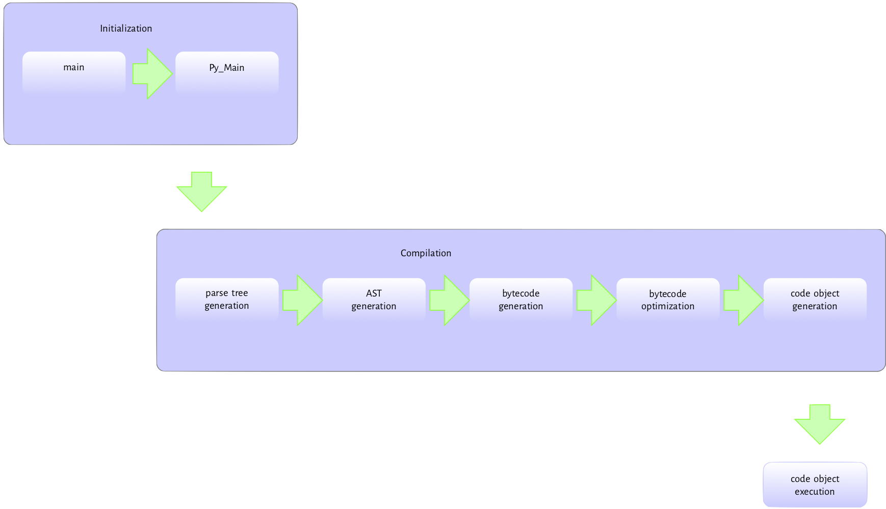

# First Program

## What is a program

* What is a program? **Ask**
* At simplest it's just a list of commands to execute to get from input to output
* Parts of program:
  * input — self-explanatory, that's data to process. It might be explicit — keyboard input or read from file; or implicit (to you) — part of source code, reading some environment variables or constants.
  * computation — operations on data. Might be math, string operations or esoteric calculations of stars positions.
    * operators (*операция*) — [symbols](https://docs.python.org/release/2.5.2/ref/operators.html) that denotes that some computation should be done, including logical and comparison. E. g.: `+, -, and, >=`
    * expression (*выражения*) — «piece of code» that can be evaluated to some value. Contains operators, function call, literals, identifiers and attribute access — all of which return a value. `3 + 5, [x for x in range(5)], dis.dis(a)`
    * statements (*оператор*)[^3] — block of code, that includes either expression, or something with keywords or assignments: `a = 1, print('Hi'), for i in range(5):, if a == 1:`
    * Don't mind it too much, but you just need to know that all of this exists.
  * Output — again, self explanatory. Result of the program execution

## How does Python runs a program

* Compiled vs interpreted

  * Compiled language, well, compiles your code before executing it. What does that mean? For computer: read whole thing and convert it at once to the machine words (I use machine words here very loosely — just to describe lowest level interaction that we interested in. Actual machine words are thing and look like `0b10111110`). For us — we need to compile whole thing before launching, but it most likely will run faster due to global-ish optimization
  * Interpreted language runs from the point you press «run», or even can be executed line-by-line in REPL (Read-Evaluate-Print Loop). Computer translates code line-by-line (well, not exactly like that, but close enough for our purposes). This speeds up development and especially debugging, but overall slover due to overhead (every step is call to the «translator») and less possible optimizations.

* Bytecode translation and PVM

  * Your code is being translated to bytecode — language that Python interpreter actually understands; it's also being saved to .pyc files — to speed up startup if code or Python version wasn't changed. Works only with write access — otherwise done in memory.

  * Python Virtual Machine is what executes that bytecode by actually translating it even further to machine words. It's written in C (hence CPython), so it's pretty fast on it's own. There are other implementation — Jython (Java), IronPython (.NET), PyPy (Python), MicroPython, CircuitPython, PyCopy (targetting microcontrollers) and many more. Though you want to stick to CPython, at least for now — it's the standard, and when somebody says Python, they mean CPython.

  * I might have omitted a few steps, but you're more than welcome to look into yourself[^1][^2]
    

  * We can take a look into bytocde ourselves with `dis` module. Don't mind `lambda` part — we'll figure it our bit (few months or so) later, for now you need to know it's just a way for us to give `print` function a name.

    ```python
    import dis
    a = lambda: print('hello')
    dis.dis(a)
    ```

* To sum everything up: source code -> bytecode + .pyc -> machine instructions

* No compilation step: **ask**. All the problems will be apparent in runtime

## How to actually run a Python program

* Lot of authors will recommend using either web-based solutions, or IDLE — skip all these. You want to learn with either tool you're going to use, or something as close as possible. Learn to troubleshoot, use dev envirement and tooling efficiently.
  * web based interpreters limit you in imports (no 3rd party modules), you have no control over Python version and can't break anything to fix it later
  * I don't even know what IDLE is — it's been broken on macOS for a while and nobody bothered to fix it. Looks like barebones IDE, might as well use a notepad at that point
* **Show and tell!**
* We'll start with CLI REPL — that would be enough for a while, and very handy for quick tasks or tests. You'll get used to have one instance running at all times eventually.
  * I've seen DB guys running SQL statements instead of calculator
  * CLI demo even if I've used it before
* Running a python script
  * Simplest way: `python file.py` or `python -m file`
    * `-m` denotes module and python will do all the usual module lookup, not just current folder
  * IDE most likely provide you with a button to run your script — it will execute something close to above command
  * More complex ways still boil down to same command, but employs things like entrypoints, main loops and even additional tools like Make, Docker and many more — we'll talk about them in due time.
* Esoteric ways to run code
  * `eval()` — executes string as a code, but only one; returns None
  * `exec()` — executes as many strings as a code as you want; returns result
    * you can even use `compile()` to compile string to Abstract Syntax Tree object to pass to eval or exec, but let's not
  * importing your script into another script, even empty one — why that works we'll learn way later
  * frozen binaries — we don't it. But it's a way to bake (despite cold name) Python interpreter into executable

## Homework

* Launch this code `print('Of course this is a good idea!')` 
  * using REPL
  * from file
  * using `eval()` or `exec()` — which one and why?
  * \* using AST
  * \* using module import
  * \*\* What does this phrase has to do with Python

[^1]: [Look inside the PVM](https://leanpub.com/insidethepythonvirtualmachine/read)
[^2]: [Write own little PVM](https://stackoverflow.com/questions/61891199/does-python-virtual-machine-require-a-cpu-to-execute-the-bytecode)
[^3]: [Programming terminology: Expression statements in Russian](https://russian.stackexchange.com/questions/7583/programming-terminology-expression-statements-in-russian)

Albums listened to: Polkadot Cadaver - Purgatory Dance Party, El Creepo - Belissimo!, Hands — Give Me Rest

