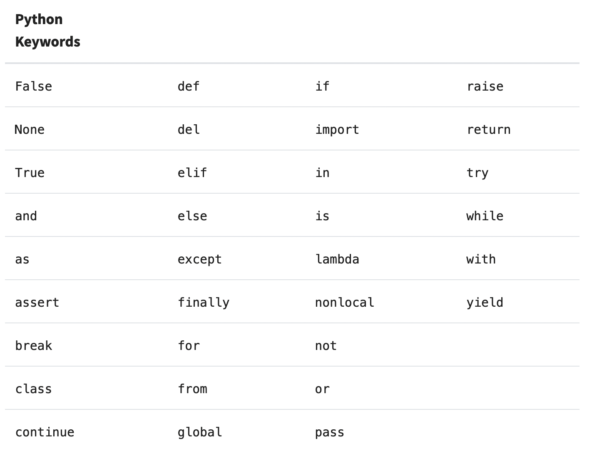

# Data types, part 1: Typing

## Typing: what is it and what are my options

* Type system — every object with should belong to one of the types. Collection of this types is type system. Also applicable to real world.

* Types you most likely to see in programming: **ask** int, string, bool

* Static typing — variable type is pre-defined, and can't be changed during execution. Set in stone.

  * Static type checking is executed before program execution
  * Tigthly tied to compiled languages, but not necessary

* Dynamic typing — type of the variable is determined in a runtime, and can be changed, but explicitly, by reassigning value of the variable.

  * **boxes example?**

* Weak typing — types can be converted implicitely. Best (or worst) example would be JavaScript:

  ```javascript
  4 + '7';      // '47'
  4 * '7';      // 28
  2 + true;     // 3
  false - 3;    // -3
  ```

* Strong typing — types can't be converted without casting.

* Casting has no direct connection with typing and just a way to convert between types — evaluate string to int and vice versa. Type does not change.

* Duck typing also isn't exactly what we are talking about, but interesting concept still.

  * In duck typing we do not care about what type object is, as long as it can do what we want it to do. *we will learn about operator overloading/duner methods eventually*
  * If it looks like a duck, walks like a duck and quacks like a duck — it's a duck enough, even if it's not precisely a duck.

* Strange Brew — Common LISP. I swear once I'll go off the deep end and learn it. It supports most of programming paradigms, but I think mostly used by functional programmers; it's main idea is symbolic computations — which isn't concerned with actual values, but more with the way you express your calculations. It's *dynamically, but strongly typed; yet compiled*. Syntax is pretty weird, `T` stands for `True `  and `nil` for `False`, tons of brackets and no while loops — but built-in mechanism to write your own; people sho use it seems like a sect. Overall a great place to start if you want to end in a forest cabin, with unkempt beard sending mail to the newspapers, if you know what I mean. 

* Which of those concept applicacable to Python? **ask** It's dynamically and strongly typed, also ducktyped.

## Typing in Python

* **start with example** `a = 3` What just happened? **ask** We assigned a variable new value — three. But what does that mean for Python? What does it think about what just happened?
* We created a variable name `a`, value in memory `3` and reference between them. Not necessary in that order, but general gist is that. 
* We now know about the fact the Python is dynamically typed. But it still has a concept of type, so it must be stored somewhere. **ask** Where might it be? Variable has no concept of type, that's what provides us with dynamic in typing. Reference is just that — reference. Type is stored in the header of the object itself, as well as some other useful information: object reference count, gc linked list etc.
* Batteries included: we can check type of the variable with `type()`. This might be more useful than you think. But might be not — see duck typing.

## Life of variable

* There are a lot of philosophycal categories — way to divide world in two (usually) parts according to my university prof; and we can apply few of them to the types in Python. But very prominent one is *mutability* **ask** 

* Mutability is a property that allows objects to be changed in place. **ask** What objects can be changed in place:

  * list, dict, set, bytearray, user-defined classes are mutable

  * int, float, decimal, complex, bool, string, tuple, range, frozenset, bytes are immutable

  * **show**:

    ```python
    a = 567
    id(a)
    a += 1
    id(a)
    b = [1, 2, 3]
    id(b)
    b.append(4)
    id(b)
    ```

* What exactly `id()` showed us? **ask** That's a reference to a memory where actual object lies. And that's giving us an interesting opportunity to compare variables — not only by their value, but also by reference.

  * **show**

  * `a == b` shows us if *values* of two variables are the same

  * `a is b` shows us if both variables point to the same object

  * `a = 'jello'; b = a` will create one object with two references to it, so `a == b and a is b`

  * `a = 'jello'; b = 'jello'` will create one object with two references to is, so `a == b and a is b` 

  * `a = 200; b = 200` -> ``a == b and a is b` 

  * `a = 500; b = 500` -> ``a == b and not a is b` 

  * `a = 'über'; b = 'über'` -> ``a == b and not a is b` 

  * Why did `jello` and 200 worked, but `über` and 500 didn't? **ask** Because of interning. Values from -5 to 256[^1] and some strings[^2] are saved in pools to avoid creating multiple copies of the same object saved in memory.

  * You can force string interning with

    ```python
    import sys
    a = sys.intern('über')
    b = sys.intern('über')
    a is b
    ```

  * Mutable references are something to be careful about: **why does this happen?**

    ```python
    a = [1, 2, 3]
    b = a
    b.append(4)
    a
    ```

* `a = 'jello'; a = 'uber'` in this case reference to the `jello` is removed. Same goes for `del a` — this also removes the variable itself. What happens next?

* This is where garbage collector comes into play. This is Python's mechanism of freeing up unused memory.

* When value have no more references to itself, garbage collector will clear this part of memory — the mechanism itself is pretty involved and does not concern us that much[^3]

* What if we have cyclic reference — for example list that contains itself? **show** Well, turns out Python has two garbage collectors — and second one is needed just for that. It's even more involved and also has generations algorhytm for keeping garbage around[^4]

* You can force garbage collection now with `import gc; gc.collect()`

## Simple part: making variables in Python

* variable vs const: one can be changed, one — cannot
* **ask** There are not const in Python, only gentlemen's agreement — caps names are const
* You don't need to create variable ahead of time, or specify it's type — because of all of the above; you still need to initialize it — can't add counter to nothing
* You need to be mindful of variable naming: **show**
  * must start with _ or letter
  * can contain letters (including non-ascii), numbers and underscores
  * case sensitive
  * can't be on of reserved words:
    
  * respect [PEP8](https://peps.python.org/pep-0008/#naming-conventions) — no `l or I or O`
* Assigning variables is really easy `a = 1`
* Homework: read throug Naming part of PEP8.
* That would be it for today.

[^1]: [int interning](https://docs.python.org/3/c-api/long.html)
[^2]:[string interning](https://stackabuse.com/guide-to-string-interning-in-python/)
[^3]: [GC desing](https://devguide.python.org/internals/garbage-collector/)
[^4]: [Two GCs](https://stackify.com/python-garbage-collection/)

Frei.Wild - Gegengift (10 Jahre Jubiläumsedition)