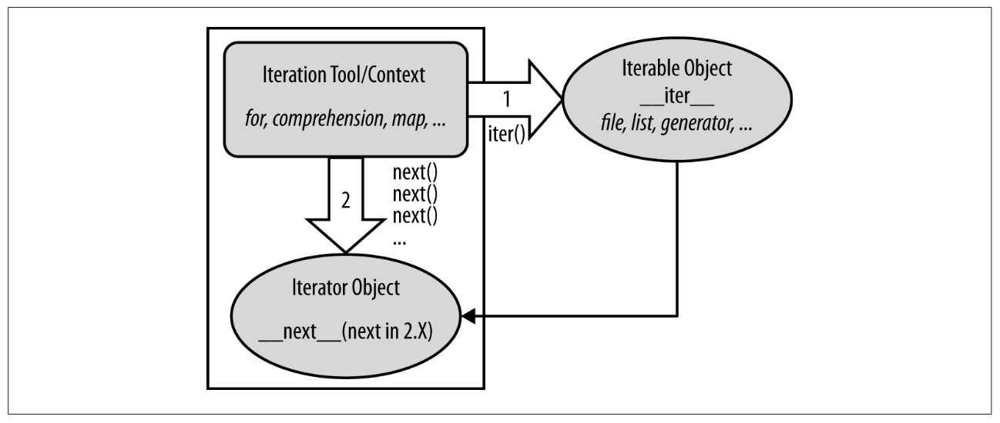

# Iterators & Files

## Iterators

* Last time we saw how effortlessly `for` loop went over the list, but I hope it left you with the question: how exactly that works?

* The answer is today's topic — iterators

* Iterators are objects that implement iteration protocol and can be used by iteration context

* Too many iterations for one sentence, but here's one more: iterable object. Lets break this down:

  * Iterable object is the object that can be iterated over — returning objects one by one

    * They can be split into two categories: real and virtual iterable objects

    * Real ones contain all the object: lists, strings, dicts and other sequenced types

    * **ask** Virtual ones still return objects one by one, but do not store them, rather generating on the fly; examples are already known to us `range` and other generators — we'll talk about them in the future, after wrapping our heads around functions

    * One thing you cannot do with iterable object, surprisingly enough, is iterate over it **show**:
      ```python
      l = [1, 2, 3, 4]
      next(l)
      ```

    * Must implement `__iter__` function, that returns iterator
      ```python
      dir(list)
      ```

  * Iterator you actually can iterate over — it's created from iterable object using `iter` function (which in turn calls `__iter__`), and implements iteration protocol

  * Iteration protocol — set of features object has to implement to be considered iterator. This includes only two things: `__next__` method that would be called by `next` function in iteration context and returns next member in collection; and it raises `StopIteration` exception when collection is exhausted

  * Iteration context — tool, that uses iterator in some way by calling `__iter__ ` to get iterator, and then `next` repeatedly until `StopIteration` is encountered: `for` loop, comprehensions etc

* Let's try to sum all of this:

  * iterable object contains or generates values, returns them one by one and returns iterator on `__iter__` method call
  * iterator implements iteration protocol and is used by iteration context directly
  * iteration protocol — requirement for iterators to implement `__next__` method that returns next object; and raise `StopIteration` when no objects left
  * Iteration context — something that directly iterates over objects using `next` function
    

* With all this knowledge we can reconstruct the way `for` loop interacts with the list and even go through it step by step:

  * First, we have our iteration context: `for` loop

  * This particualr iteration context can request iterator from iterable object, which it does by calling `iter(list)`

  * Returned value is the iterator we need

  * Context goes through iterator, made from list by calling `next` over and over

  * Once `StopIteration` is raised, control is passed from loop to the next piece of code
    ```python
    iterable_object = [1, 2, 3, 4]
    iterator = iter(iterable_object)  # same as iterable_object.__iter__()
    # start of the iteration context
    next(iterator)  # same as iterator.__next__()
    next(iterator)
    next(iterator)
    next(iterator)
    next(iterator)  # this raises StopIteration
    # end of iteration context
    ```

* What does end of iterations mean? It means that iterator got exhausted and has no objects left in it. But the iterable object isn't changed — and how could it be, since touples are iterable but immutable.

* Some iterators can't be exhausted — infinite generators, for example, or infinite iterators like `cycle` from `itertools`

* But ones that can, can be just recreated from the same iterable object

* Usually you don't need to do this, since the point of iteration is to get all items from the iterable object, and not cycle through them over and over

* And of course you can write you own iterable object and iterator it returns — this is the topic for when we will be looking at Classes, but basics can fit nicely in today's discussion

  * For example let's use an absolutely useless class that returns one if RNG says so

  * First — the class itself

  * Then make it into iterable object by implementing `__iter__` method, but for now with just a stub **ask** using `pass`

  * Now for the interesting part — we will be implementing the `__next__` method in the same class, making it effectively iterable object and iterator at the same time

  * Method would be using `randint(0, 5)` as RNG and return `1` if RNG value is non-zero; or `StopIteration` when it is

  * And since our class is iterator itself, what it should return from `__iter__` method is `self`

  * Let's try this out
    ```python
    from random import randint
    class RandomIter:
      def __iter__(self):
        return self
      
      def __next__(self):
        if randint(0, 5):
          return 1
        else:  # else here is optional because return stops the execution of functions, like break does for loops
          raise StopIteration
          
    randomiter_iter_obj = RandomIter()
    randomiter_iter = iter(randomiter_iter_obj)
    next(randomiter_iter)
    ```

  * Since our iterable object is iterator itself, we can call next on it, without creating iterator
    `next(randomiter_iter_obj)`

  * But we still need to implement it, because iterable context rely on it
    ```python
    class BadIter:
      def __next__(self):
        return 1
      
    next(BadIter())
    for i in BadIter:
      print(i)
    ```

## Files

* Files are it's own entire beast, so complex and elaborate that there are entire file systems (note plural!), and do they bring headache

  * Try to write something on NTFS drive with mac
  * Try to do anything with ext partition with windows
  * boot anything from non-FAT drive
  * And many, many more such cases

* Taking that in consideration, let's look at most basic Python operations connected to files: open, read, write and close

* Open is self-explanatory — it opens a file for reading or writing, depending on open mode:
  ```python
  file_object = open('path', mode='')
  ```

  * Files can be opened in either text or binary format; text is unicode text, binary is raw representation of the file
    **show** on non-ascii text
  * Text format is default; binary format is specified by adding `b` after mode
  * available modes are `r, w, a` for read, write and append
    * read opens file in read-only mode, no writing is possible
    * write opens file in writing mode, no reading possible; all contents of the file is removed on open; file created if does not exist
    * append same as writing mode, but content is not removed, but new data is appended at the end of file
  * `+` added to the mode adds writing to the read mode and reading to the write mode, read and write mode

* Close is self-explanatory too — it flushes file buffer to the file, and closes the handle. Operations on closed file are impossible

  * `fh.flush()` is a way to ensure content is saved to the file without closing the file
  * Open files need to be closed because if file isn't closed or flushed and something crashes — no changes will be saved; and OS limits number of open file descriptors tied to a single process — if you never close your files, at some point OS will not let open any more

* Best way to open files is not by using just `open`, but with context manager — a Python construction automatically closes the file after all the code inside it was executed
  ```python
  with open(file, mode) as fh:
    pass
  # file is closed here already
  ```

  * Many things in Python has context managers: connections, DAGs etc. If they are available — use them
  * You can write your own context managers as a part of a class or using decorator[^1]

* Read allows you to read content of the file. In most cases that would be a text file, and `read` would return entire file; `readline` — a single line; `readlines` — list of lines

  * Don't use any of those — file object is iterable object, leverage this by going line by line with iteration context:
    ```python
    with open(file, mode) as fh:
      for line in fh:
        # returns line by line
        pass
    ```

* Write does just that — writes a string, or list of strings (with `writelines`) to an open with right mode file

* There are a few more file methods, but I find them used seldomly[^2]

* For some structured file types — JSON, CSV, YAML — there are separate packages for reading them. Some of them included with Python, some are third party; some are really straightforward, and some are CSV.

## Homework

* Next our meeting will be last this year — I'm going on vacation until January
* We will discuss functions and that will give you all the tools you need for this assigment
* You need to come up with a project you want to do in Python by the end of the course
* Be realistic — no second Instagram, but maybe a tool to automate some boring stuff, like ordering files in your Downloads
* By the next week you need to have general idea of what you want your project to be
* You can come up with as many as you want, the more — the better
* Here's the kicker — you are not the person who would be making it
* And next week assignment will be aimed at finding an owner for every project

  

[^1]: https://book.pythontips.com/en/latest/context_managers.html
[^2]: https://pynative.com/python-file-objects/
